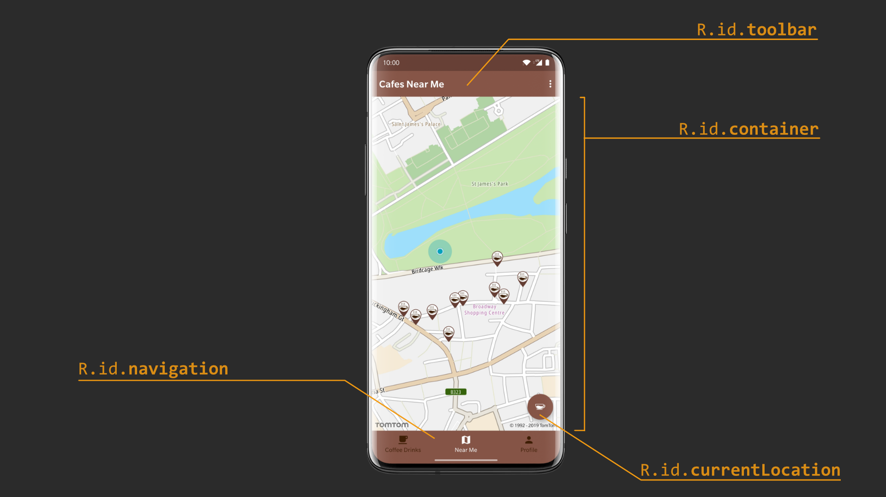

# ImBarista-App

The **I'm Barista** application has a list of coffee drinks with a description of each coffee drink. The app was created for testing workshop and demonstrate many general practises which are usually used in mobile applications.  

Features of the application:
* Demonstrating list of coffee drinks
* User can mark/unmark coffee drink as a favourite
* User can create account/Login into app
* User can interact with a map and find a cafe

**Create Account** and **Login** screen

  
  

**Coffee drinks**, **Near Me** and **Profile** screens

  
  
  

**Coffee drinks details** and **Settings** screens

  
  

# Structure of the project
The project has the main branches:
* master
* workshop-start

The **master** branch has all test cases with solutions.

The **workshop-start** branch has all failed test cases with description for each test case and test classes.   

# App screens with views
**"Login" screen**

  

**"Create Account" screen**

  

**"Home - Coffee drinks" screen**

  

**"Coffee drink details" screen**

  

**"Home - Near Me" screen**

  

**"Home - Profile" screen**

  

**"Settings" screen**

  

# Configuration
* TomTom Maps API key should be added as System variable with the `BARISTA_TOMTOM_MAPS_API_KEY` key
* Google Maps API key should be added as System variable with the `BARISTA_GOOGLE_MAPS_API_KEY` key